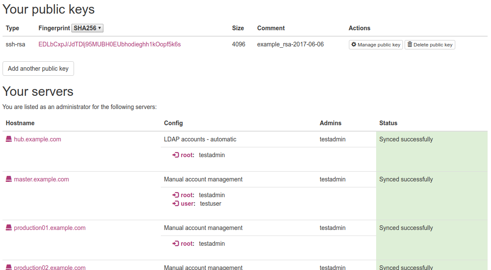
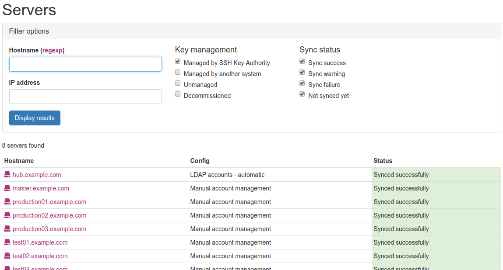
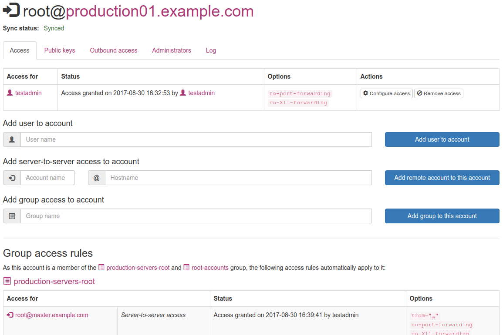
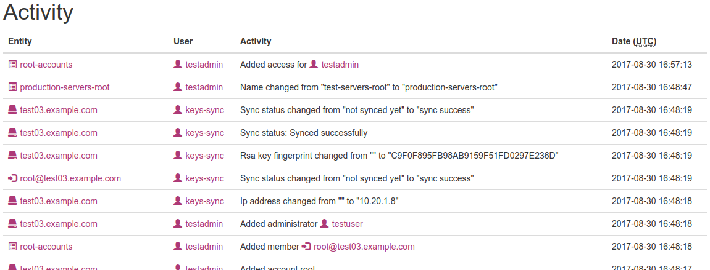
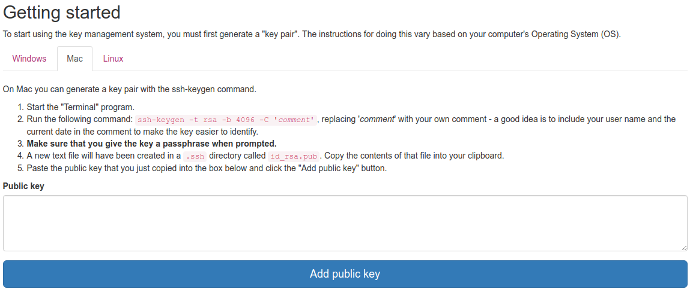

SKA - SSH Key Authority
=======================

*Please see the [Security Advisories](#security-advisories) section below for a recently addressed security issue*

A tool for managing user and server SSH access to any number of servers.

Features
--------

* Easily manage SSH key access for all accounts on your servers.
* Manage user access and server-to-server access rules.
* Integrate with your LDAP directory service for user authorization.
* Automatically remove server access from people when they leave your team.
* Provides an easy interface for your users to upload their public keys.
* Designate server administrators and let them manage access to their own server.
* Create group-based access rules for easier management.
* Specify SSH access options such as `command=`, `nopty` etc on your access rules.
* All access changes are logged to the database and to the system logs. Granting of access is also reported by email.
* Be notified when a server becomes orphaned (has no active administrators).

Demo
----

You can view the SSH Key Authority in action on the [demonstration server](https://ska.xiven.com/).

Use one of the following sets of username / password credentials to log in:

* testuser / testuser - normal user with admin access granted to a few servers
* testadmin / testadmin - admin user

All data on this demonstration server is reset nightly at 00:00 UTC.

Requirements
------------

* An LDAP directory service
* Apache 2.2 or higher
* PHP 5.6 or higher
* PHP JSON extension
* PHP LDAP extension
* PHP mbstring (Multibyte String) extension
* PHP MySQL extension
* PHP ssh2 extension
* MySQL (5.5+), Percona Server (5.5+) or MariaDB database

Installation
------------

1.  Clone the repo somewhere outside of your default Apache document root.

2.  Add the following directives to your Apache configuration (eg. virtual host config):

        DocumentRoot /path/to/ska/public_html
        DirectoryIndex init.php
        FallbackResource /init.php

3.  Create a MySQL user and database (run in MySQL shell):

        CREATE USER 'ska-user'@'localhost' IDENTIFIED BY 'password';
        CREATE DATABASE `ska-db` DEFAULT CHARACTER SET utf8mb4;
        GRANT ALL ON `ska-db`.* to 'ska-user'@'localhost';

4.  Copy the file `config/config-sample.ini` to `config/config.ini` and edit the settings as required.

5.  Set up authnz_ldap for your virtual host (or any other authentication module that will pass on an Auth-user
    variable to the application).

6.  Set `scripts/ldap_update.php` to run on a regular cron job.

7.  Generate an SSH key pair to synchronize with. SSH Key Authority will expect to find the files as `config/keys-sync` and `config/keys-sync.pub`
    for the private and public keys respectively. The key must be in `pem` format. The following command will generate the key in the required format:

        ssh-keygen -t rsa -b 4096 -m PEM -C 'comment' -f config/keys-sync

8.  Install the SSH key synchronization daemon. For systemd:

    1.  Copy `services/systemd/keys-sync.service` to `/etc/systemd/system/`
    2.  Modify `ExecStart` path and `User` as necessary. If SSH Key Authority is installed under `/home`, disable `ProtectHome`.
    3.  `systemctl daemon-reload`
    4.  `systemctl enable keys-sync.service`

    for sysv-init:

    1.  Copy `services/init.d/keys-sync` to `/etc/init.d/`
    2.  Modify `SCRIPT` path and `USER` as necessary.
    3.  `update-rc.d keys-sync defaults`

Usage
-----

Anyone in the LDAP group defined under `admin_group_cn` in `config/config.ini` will be able to manage accounts and servers.

Key distribution
----------------

SSH Key Authority distributes authorized keys to your servers via SSH. It does this by:

1.  Connecting to the server with SSH, authorizing as the `keys-sync` user.
2.  Writing the appropriate authorized keys to named user files in `/var/local/keys-sync/` (eg. all authorized keys for the root user will be written to `/var/local/keys-sync/root`).

This means that your SSH installation will need to be reconfigured to read authorized keys from `/var/local/keys-sync/`.

Please note that doing so will deny access to any existing SSH public key authorized in the default `~/.ssh` directories.

Under OpenSSH, the configuration changes needed are:

    AuthorizedKeysFile /var/local/keys-sync/%u
    StrictModes no

StrictModes must be disabled because the files will all be owned by the keys-sync user.

The file `/var/local/keys-sync/keys-sync` must exist, with the same contents as the `config/keys-sync.pub` file in order for the synchronization daemon to authenticate.

Screenshots
-----------

### Homepage overview

### Server listing

### Server account access management

### Activity log

### Getting started guide for new users

Security advisories
-------------------
* [SKA security advisory: SSH port redirection attack](https://github.com/operasoftware/ssh-key-authority/wiki/SKA-security-advisory%3A-SSH-port-redirection-attack)

License
-------

Copyright 2013-2017 Opera Software

Licensed under the Apache License, Version 2.0 (the "License");
you may not use this file except in compliance with the License.
You may obtain a copy of the License at

   http://www.apache.org/licenses/LICENSE-2.0

Unless required by applicable law or agreed to in writing, software
distributed under the License is distributed on an "AS IS" BASIS,
WITHOUT WARRANTIES OR CONDITIONS OF ANY KIND, either express or implied.
See the License for the specific language governing permissions and
limitations under the License.
